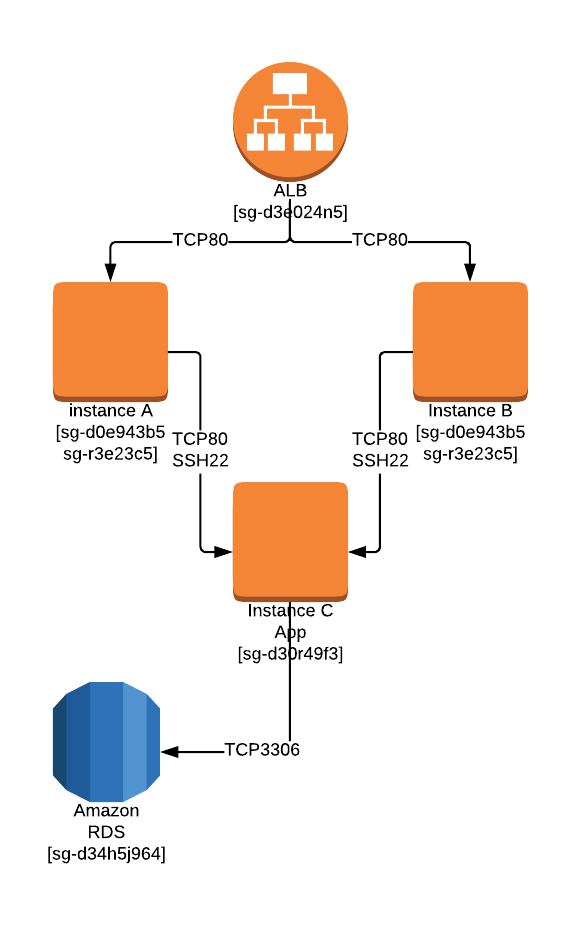

AWS Effective Security Groups Visualisation
==============

## Introduction
AWS Security groups are far from the traditional instance firewall rules, and as such it's hard to get your head around them. With often more than one SG assigned to a resource, the effective rules are difficult to process, and to get verification that they setup securely. When considering the thin line between private and public subnets, this is especially important.
Currently, even for simple SG to SG visualisation, tooling is very limited. (see https://github.com/y13i/sgviz)
The visualisation tool should be able to neatly show the relationship that the SG has between various AWS services and display the type of traffic that they are accepting between each other. One could then review the output at a security level, and it would also make troubleshooting far easier.

## Tasks

Small administrative tasks
    - Review commercial space for similar tools.
    - Find a js library which can display the front end.
    - Include icon sets per provider for the visualisation.
Mid-tier technical tasks
    - Package and document usage.
    - Create a generic data model.
Technical programming task
    - Implement the data processor.

## Prerequisites

Must have:
    - Basic understanding of AWS networking and services (AWS SG, NACL, Routing)
    - Have at least one of the back end programming languages for the data processor (python, go, node, rust)

Good to have:
    - Knowledge of js libraries such as d3.js, or Chart.js.
