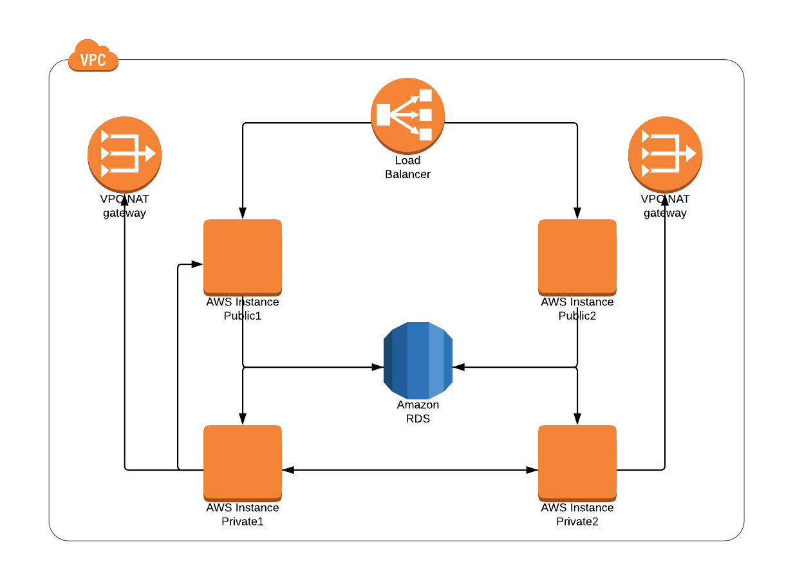

VPC Flow Log Visualiser
==============

## Introduction
All major cloud providers have an option to generate flow logs for the Virtual Private Cloud; [AWS][1], [GCP][2] and [Azure][3]. However, all of them create only text format logs, which are difficult to analyse and understand.
There are few commercial products available for data presentation, but nothing in the Open Source Space.
Flow logs can assist in troubleshooting issues within your infrastructure. Visual aid could improve the speed in which you can identify problems. The main benefit however, would be to easily see exactly what services are interacting with each other. From a security perspective, you could see architectural mistakes, where there is traffic between two components which are not supposed to be communicating. This would also be a useful tool when completing and presenting a security audit.
This very simple example illustrates that the private subnet instance can communicate to the public layer, a line in a log file that could easily be missed by the human eye.

## Tasks

Small administrative tasks
    - Review commercial space for similar products.
    - Find a js library which can display the front end.
    - Include icon sets per provider.
Mid tier technical tasks
    - Package and document usage.
    - Create a generic data model which suits the big three.
Technical programming task
    - Implement the data processor.

## Prerequisites

Must have:
    - Basic understanding of networking and services for each cloud provider.
    - Have knowledge of at least one back end programming language for the data processor (python, go, node, rust).

Good to have:
    - Knowledge of js libraries such as d3.js or Chart.js.
    - Understanding of Netflow or another network metadata solution.

[1]: https://docs.aws.amazon.com/vpc/latest/userguide/flow-logs.html
[2]: https://cloud.google.com/vpc/docs/using-flow-logs
[3]: https://docs.microsoft.com/en-us/azure/network-watcher/network-watcher-nsg-flow-logging-portal
